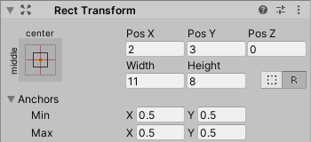
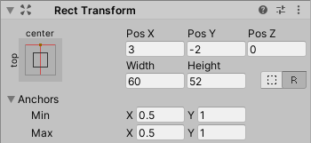
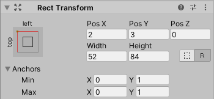
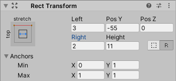
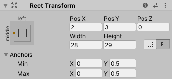
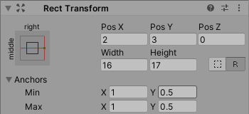
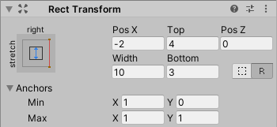
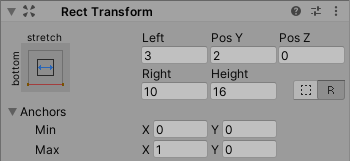
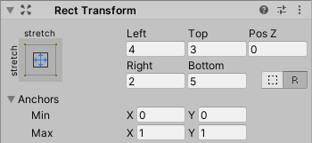

# Unity组件-Button

来源链接 <https://blog.csdn.net/xzqsr2011/article/details/104036830>

<https://www.cnblogs.com/guangzhiruijie/p/15835916.html>

## 注意事项

在阅读本文之前，需要首先掌握如何在 Inspector 面板中设置 RectTransform。本文起到将代码与 Inspector 面板对应之用。

## 设置大小和位置

使用代码动态设置 RectTransform 的方式与 Anchors 有关，对不同的 Anchors 取值，需要使用不一样的函数。参考下列情形。

### 各种情形

#### 情形 1：Anchors 汇聚于中心

此时应使用如下代码：

```csharp
rectTransform.anchorMin = new Vector2(0.5f, 0.5f);
rectTransform.anchorMax = new Vector2(0.5f, 0.5f);
rectTransform.sizeDelta = new Vector2(11, 8);
rectTransform.anchoredPosition = new Vector2(2, 3);
```

对应效果如下：  


这也是国内大多数帖子中说的，使用 `sizeDelta` 设置 RectTransform 尺寸的方法。但这种方法仅当 Anchors 位于中心（其他表述：四个值重合、一致、相同、together）时才成立；然而，在实际业务中 Anchors 位于中心的情况，没有那么经常地被使用。  
关于 `sizeDelta`，见：[https://docs.unity3d.com/ScriptReference/RectTransform-sizeDelta.html](https://docs.unity3d.com/ScriptReference/RectTransform-sizeDelta.html)

#### 情形 2：Anchors 汇聚于顶部中心

此时应使用如下代码：

```csharp
rectTransform.anchorMin = new Vector2(0.5f, 1);
rectTransform.anchorMax = new Vector2(0.5f, 1);
rectTransform.SetInsetAndSizeFromParentEdge(RectTransform.Edge.Top, 2, 52);
rectTransform.SetSizeWithCurrentAnchors(RectTransform.Axis.Horizontal, 60);
rectTransform.anchoredPosition = new Vector2(3, rectTransform.anchoredPosition.y);
```

对应效果如下：  


#### 情形 3：Anchors 汇聚于左上角

此时应使用如下代码：

```csharp
rectTransform.anchorMin = new Vector2(0, 1);
rectTransform.anchorMax = new Vector2(0, 1);
rectTransform.SetSizeWithCurrentAnchors(RectTransform.Axis.Horizontal, 52);
rectTransform.SetSizeWithCurrentAnchors(RectTransform.Axis.Vertical, 84);
rectTransform.anchoredPosition = new Vector2(2, 3);
```

对应效果如下：



#### 情形 4：Anchors 分散于顶部两端

此时应使用如下代码：

```csharp
rectTransform.anchorMin = new Vector2(0, 1);
rectTransform.anchorMax = new Vector2(1, 1);
rectTransform.SetInsetAndSizeFromParentEdge(RectTransform.Edge.Top, 55, 11);
rectTransform.offsetMin = new Vector2(3, rectTransform.offsetMin.y);
rectTransform.offsetMax = new Vector2(-2, rectTransform.offsetMax.y);
```

对应效果如下：  



#### 情形 5：Anchors 汇聚于左侧中心

此时应使用如下代码：

```csharp
rectTransform.anchorMin = new Vector2(0, 0.5f);
rectTransform.anchorMax = new Vector2(0, 0.5f);
rectTransform.SetSizeWithCurrentAnchors(RectTransform.Axis.Horizontal, 28);
rectTransform.SetSizeWithCurrentAnchors(RectTransform.Axis.Vertical, 29);
rectTransform.anchoredPosition = new Vector2(2, 3);
```

对应效果如下：  



#### 情形 6：Anchors 汇聚于右侧中心

此时应使用如下代码：

```csharp
rectTransform.anchorMin = new Vector2(1, 0.5f);
rectTransform.anchorMax = new Vector2(1, 0.5f);
rectTransform.SetSizeWithCurrentAnchors(RectTransform.Axis.Horizontal, 16);
rectTransform.SetSizeWithCurrentAnchors(RectTransform.Axis.Vertical, 17);
rectTransform.anchoredPosition = new Vector2(2, 3);
```

对应效果如下：  



#### 情形 7：Anchors 分散于右侧两端

此时应使用如下代码：

```csharp
rectTransform.anchorMin = new Vector2(1, 0);
rectTransform.anchorMax = new Vector2(1, 1);
rectTransform.SetInsetAndSizeFromParentEdge(RectTransform.Edge.Right, 2, 10);
rectTransform.offsetMin = new Vector2(rectTransform.offsetMin.x, 3);
rectTransform.offsetMax = new Vector2(rectTransform.offsetMax.x, -4);
```

对应效果如下：  



#### 情形 8：Anchors 分散于底部两端

此时应使用如下代码：

```csharp
rectTransform.anchorMin = new Vector2(0, 0);
rectTransform.anchorMax = new Vector2(1, 0);
rectTransform.SetInsetAndSizeFromParentEdge(RectTransform.Edge.Bottom, 2, 16);
rectTransform.offsetMin = new Vector2(3, rectTransform.offsetMin.y);
rectTransform.offsetMax = new Vector2(-10, rectTransform.offsetMax.y);
```

对应效果如下：  



#### 情形 9：Anchors 分散于四角

此时应使用如下代码：

```csharp
rectTransform.anchorMin = new Vector2(0, 0);
rectTransform.anchorMax = new Vector2(1, 1);
rectTransform.offsetMin = new Vector2(4, 5);
rectTransform.offsetMax = new Vector2(-2, -3);
```

对应效果如下：  



#### 其他情形

（待补充）

### 结论

1.  理解了上述几种情形，即可推广到各种 Anchors 的情形中。
2.  `SetInsetAndSizeFromParentEdge` 设定 RectTransform 到父对象的某一边（参数：`edge`）的距离（参数：`inset`），以及在该轴向上的大小（参数：`size`）。
3.  `SetSizeWithCurrentAnchors` 只设定 RectTransform 在某轴向（参数：`axis`）上的大小（参数：`size`），还需要 `anchoredPosition` 辅助设定其在该轴向上的位置。
4.  当 Anchors 分散（即在某方向上存在 Stretch）时，需要使用 `offsetMin` 和 `offsetMax` 的对应分量来设定位置（即 RectTransform 到父对象边缘的距离）。

### 补：一个无需考虑 Anchors 情形来设置大小的方法

此方法参考：  
[https://www.cnblogs.com/AaronBlogs/p/7110227.html](https://www.cnblogs.com/AaronBlogs/p/7110227.html)  
[https://gameinstitute.qq.com/community/detail/123769](https://gameinstitute.qq.com/community/detail/123769)  
仅可设置大小，不可设置位置（测试可用）：

```csharp
public static void SetRectTransformSize(RectTransform trans, Vector2 newSize)
    {
        Vector2 oldSize = trans.rect.size;
        Vector2 deltaSize = newSize - oldSize;
        trans.offsetMin = trans.offsetMin - new Vector2(deltaSize.x * trans.pivot.x, deltaSize.y * trans.pivot.y);
        trans.offsetMax = trans.offsetMax + new Vector2(deltaSize.x * (1f - trans.pivot.x), deltaSize.y * (1f - trans.pivot.y));
    }
```

## 获取大小和位置

### 获取大小

使用

```csharp
Vector2 size = rectTransform.rect.size;
```

返回此 RectTransform 所在的矩形的大小，无论 Anchors 为何种情形。

### 获取位置

使用

```csharp
Vector2 position = rectTransform.anchoredPosition;
```

返回此 RectTransform 的 `pivot` 所在处相对其 Anchors 代表的参考点的位置。

（本“获取位置”小节尚未进行深入验证，可能有待修改或补充）