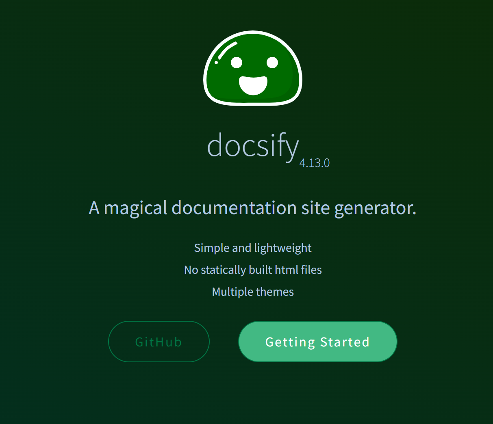

<!-- <h1 style="text-align:center">Docsify搭建</h1> -->
# Docsify搭建

网站搭建参考docsify

## 使用

**[源码下载](<https://github.com/docsifyjs/docsify/>)**

## 参考网站

**[神器docsify 用MarkDown 来写自己的网站(推荐)](<https://blog.csdn.net/shiliang97/article/details/110500387>)**

**[插件网站](<https://www.jsdelivr.com/>)**

**[官方网站](<https://docsify.js.org/#/zh-cn/>)**

**[官方推荐:文档化主题](<https://jhildenbiddle.github.io/docsify-themeable/#/>)**

**[docsify的配置+全插件列表](<https://xhhdd.cc/index.php/archives/80/>)**

**[如何使用docsify给蘑菇博客编写开发文档](<https://gitee.com/moxi159753/LearningNotes/blob/master/%E6%9D%82%E8%AE%B0/%E5%A6%82%E4%BD%95%E4%BD%BF%E7%94%A8docsify%E7%BB%99%E8%98%91%E8%8F%87%E5%8D%9A%E5%AE%A2%E7%BC%96%E5%86%99%E5%BC%80%E5%8F%91%E6%96%87%E6%A1%A3/README.md>)**

**[使用docsify配置说明文档](<https://blog.pyrroleach.com/index.php/archives/118/>)**

**[docsify笔记 02：主题、插件与其它个性化设置](<https://blog.csdn.net/Naisu_kun/article/details/128254451>)**

**[工具--docsify详解](<https://blog.csdn.net/liyou123456789/article/details/124504727/>)**

## 其他

可以更换的网站模板

参考

**临时:[typecho](<https://typecho.org/>)**

