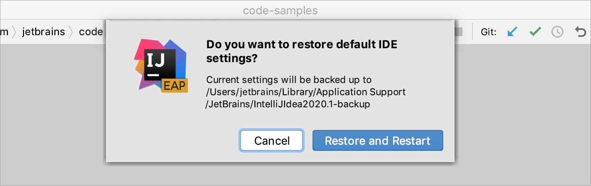

# 重置设置

https://www.jetbrains.com/help/idea/configuring-project-and-ide-settings.html

IntelliJ IDEA 恢复出厂设置

引言
如果你不小心修改了设置，导致出现问题且不知道解决办法，可以尝试恢复出厂设置

IDEA 恢复出厂设置
IDEA 2021 之后， 在顶部工具栏，选择 File | Manage IDE Settings | Restore Default Settings.

或者，

双击 shift -> 输入 Restore default settings

IntelliJ IDEA 会弹出如下提示，点击恢复并重启即可

