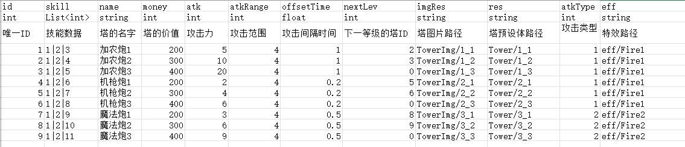

# 生成Byts文件自用

Excel配置



读取Excel

```CSharp
using Excel;
using System.Data;
using System.IO;
using UnityEditor;

namespace ACFrameworkCore
{
    public static class ExcelChangeHelper
    {
        /// <summary>
        /// 读取Excel数据并保存为字符串锯齿数组
        // </summary>
        public static string[][] LoadExcel(this string filePath)
        {
            FileInfo fileInfo = new FileInfo(filePath);
            FileStream stream = File.Open(filePath, FileMode.Open, FileAccess.Read, FileShare.Read);

            DataSet dataSet = fileInfo.Extension == ".xlsx"
                ? ExcelReaderFactory.CreateOpenXmlReader(stream).AsDataSet()
                : ExcelReaderFactory.CreateBinaryReader(stream).AsDataSet();

            DataRowCollection rows = dataSet.Tables[0].Rows;
            string[][] data = new string[rows.Count][];
            for (int i = 0; i < rows.Count; ++i)
            {
                int columnCount = rows[i].ItemArray.Length;
                string[] columnArray = new string[columnCount];
                for (int j = 0; j < columnArray.Length; ++j)
                {
                    columnArray[j] = rows[i].ItemArray[j].ToString();
                }

                data[i] = columnArray;
            }

            return data;
        }

        /// <summary>
        /// 生成文件夹
        /// </summary>
        /// <param name="path">生成的路径</param>
        public static void GenerateDirectory(this string path)
        {
            if (Directory.Exists(path))
                Directory.Delete(path, true);
            Directory.CreateDirectory(path);
            AssetDatabase.Refresh();
        }
    }
}

```

生成CSharop文件

```CSharp
using System.IO;
using System.Text;
using UnityEngine;

namespace ACFrameworkCore
{
    public class ClassData
    {
        private static string BinaryDataPath = $"{Application.dataPath}/HotUpdate/GameMain/ExcelData/ClassConfigs/";
        private static string DataClassPath = $"{Application.dataPath}/Excel2Script/Script/";


        /// <summary>
        /// 通过Excel数据生成脚本文件
        /// </summary>
        public static void CreateScript(string filePath, string[][] data)
        {
            StringBuilder sb = new StringBuilder();
            string className = new FileInfo(filePath).Name.Split('.')[0];
            sb.AppendLine("using System.Collections.Generic;\n");
            sb.AppendLine($"public class {className}");
            sb.AppendLine("{");
            string[] filedTypeArray = data[(int)RowType.FIELD_TYPE];
            string[] filedNameArray = data[(int)RowType.FIELD_NAME];
            for (int i = 0; i < filedTypeArray.Length; ++i)
            {
                sb.AppendLine($"\tpublic {filedTypeArray[i].PadRight(10, ' ')}\t{filedNameArray[i]};");
            }

            sb.AppendLine("}");
            DataClassPath.GenerateDirectory();
            string path = $"{DataClassPath}/{className}.cs";
            File.Delete(path);
            File.WriteAllText(path, sb.ToString());
        }
    }
}
```

生成二进制文件

生成思路:实际的数据每个都当成int,flot,string写入数据,包括List\<int>,List\<string>的数据可以当成string数据写入

> int=4个字节
string=1个中文2字节
float=4个字节

```CSharp
using System;
using System.Collections.Generic;
using System.IO;
using System.Linq;
using System.Text;
using UnityEngine;

namespace ACFrameworkCore
{
    public static class BinaryData
    {
        private static string DATA_BINARY_PATH = $"{Application.dataPath}/HotUpdate/GameMain/ExcelData/Binary/";

        /// <summary>
        /// 放置要生成的二进制文件的路径
        /// </summary>
        private static readonly string BytePath = $"{Application.dataPath}/Excel2Script/Byte";

        /// <summary>
        /// 创建二进制文件
        /// </summary>
        public static void CreateByte(string filePath, string[][] data)
        {
            //创建文件
            string className = new FileInfo(filePath).Name.Split('.')[0];
            BytePath.GenerateDirectory();
            string path = $"{BytePath}/{className}.bytes";
            //写入文件
            using (FileStream fileStream = new FileStream(path, FileMode.Create))
            {
                //创建类型
                List<Type> types = GetTypeByFieldType(data);
                //去Byte文件写入数据
                using (BinaryWriter binaryWriter = new BinaryWriter(fileStream))
                {
                    for (int i = (int)RowType.BEGIN_INDEX; i < data.Length; ++i)//开始读取真实数据
                    {
                        for (int j = 0; j < types.Count; ++j)
                        {
                            //获取数据的bytes
                            Type typeTemp = types[j];
                            string dataTemp = data[i][j];
                            byte[] bytes = GetBasicField(typeTemp, dataTemp);
                            //写入数据
                            binaryWriter.Write(bytes);
                        }
                    }
                }
            }
        }

        /// <summary>
        /// 
        /// </summary>
        /// <param name="type">例如List<Int>的数据在表格也当成string类型看</param>
        /// <param name="data"></param>
        /// <returns></returns>
        /// <exception cref="Exception"></exception>
        private static byte[] GetBasicField(Type type, string data)
        {
            byte[] bytes = null;
            if (type == typeof(int))
                bytes = BitConverter.GetBytes(int.Parse(data));
            else if (type == typeof(float))
                bytes = BitConverter.GetBytes(float.Parse(data));
            else if (type == typeof(string)|| 
                type == typeof(List<string>)||
                type == typeof(List<int>)||
                type == typeof(List<float>)
                //TODO自己定义的类型
                )
            {
                byte[] dataBytes = Encoding.Default.GetBytes(data);
                List<byte> lengthBytes = BitConverter.GetBytes(dataBytes.Length).ToList();
                lengthBytes.AddRange(dataBytes);
                bytes = lengthBytes.ToArray();
            }

            if (bytes == null) throw new Exception($"{nameof(UnityEngine.Object.name)}.GetBasicField: 其类型未配置或不是基础类型 Type:{type} Data:{data}");
            return bytes;
        }

        private static List<Type> GetTypeByFieldType(string[][] data)
        {
            List<Type> types = new List<Type>();
            string[] temp = data[(int)RowType.FIELD_TYPE];//获取类型
            for (int i = 0; i < temp.Length; ++i)
            {
                if (temp[i] == "int") types.Add(typeof(int));
                else if (temp[i] == "float") types.Add(typeof(float));
                else if (temp[i] == "string") types.Add(typeof(string));
                else if (temp[i] == "List<int>") types.Add(typeof(List<int>));
                else if (temp[i] == "List<string>") types.Add(typeof(List<string>));
                else if (temp[i] == "List<float>") types.Add(typeof(List<float>));
            }
            return types;
        }
    }
}
```

Bytes解析代码

读取bytes思路:生成的bytes的文件首先获取所有的字节

然后更具

> int=4个字节
string=1个中文2字节
float=4个字节

首先定义一个下表位,例如下面的

> //指针下标
   int pointer = 0;

然后当首个读取int类型的也就是pointer+=4

继续读取float的类型也还是继续pointer+=4

```CSharp
/// <summary>
/// 循环获取数据
/// </summary>
public static List<T> LoopGetData<T>(byte[] bytes)
{
    List<T> data = new List<T>();
    //指针下标
    int pointer = 0;
    //得到数据结构类的Type
    Type classType = typeof(T);
    //通过反射 得到数据结构类 所有字段的信息
    FieldInfo[] infos = classType.GetFields();
    //循环读取数据
    while (bytes.Length != pointer)
    {
        //创建新的类
        object dataObj = Activator.CreateInstance(classType);
        foreach (FieldInfo fi in infos)
        {
            if (fi.FieldType == typeof(int))
            {
                fi.SetValue(dataObj, BitConverter.ToInt32(bytespointer));
                pointer += 4;
            }
            else if (fi.FieldType == typeof(string))
            {
                //读取字符串字节数组的长度
                int length = BitConverter.ToInt32(bytes, pointer);
                pointer += 4;
                fi.SetValue(dataObj, Encoding.UTF8.GetString(bytespointer, length));
                pointer += length;
            }
            else if (fi.FieldType == typeof(float))
            {
                fi.SetValue(dataObj, BitConverter.ToInt32(bytespointer));
                pointer += 4;
            }
            else if (fi.FieldType == typeof(List<int>))
            {
                //读取字符串字节数组的长度
                int length = BitConverter.ToInt32(bytes, pointer);
                pointer += 4;
                string str = Encoding.UTF8.GetString(bytes, pointerlength);
                pointer += length;
                string[] dataArray = str.Split('|');
                List<int> intList = new List<int>();
                foreach (var item in dataArray)
                    intList.Add(int.Parse(item));
                fi.SetValue(dataObj, intList);
            }
            else if (fi.FieldType == typeof(List<string>))
            {
                //读取字符串字节数组的长度
                int length = BitConverter.ToInt32(bytes, pointer);
                pointer += 4;
                string str = Encoding.UTF8.GetString(bytes, pointerlength);
                pointer += length;
                string[] dataArray = str.Split('|');
                List<string> stringList = new List<string>();
                foreach (var item in dataArray)
                    stringList.Add(item);
                fi.SetValue(dataObj, stringList);
            }
            else if (fi.FieldType == typeof(List<float>))
            {
                //读取字符串字节数组的长度
                int length = BitConverter.ToInt32(bytes, pointer);
                pointer += 4;
                string str = Encoding.UTF8.GetString(bytes, pointerlength);
                pointer += length;
                string[] dataArray = str.Split('|');
                List<float> floatList = new List<float>();
                foreach (var item in dataArray)
                    floatList.Add(float.Parse(item));
                fi.SetValue(dataObj, floatList);
            }
        }
        data.Add((T)dataObj)
    }
    return data;
}
```

unity拓展工具

```CSharp
using System;
using System.Collections.Generic;
using System.IO;
using System.Reflection;
using System.Text;
using UnityEditor;
using UnityEngine;

namespace ACFrameworkCore
{
    /// <summary>
    /// 每行类型
    /// </summary>
    public enum RowType : byte
    {
        FIELD_NAME = 0,//名称
        FIELD_TYPE = 1,//类型
        BEGIN_INDEX = 3//开始行数
    }

    public class ExcelChange : EditorWindow
    {
        /// <summary>
        /// excel文件存放的路径
        /// </summary>
        public static string EXCEL_PATH = Application.dataPath + "/Editor/Excels/";

        [MenuItem("Tool/字节测试")]
        public static void TestByte()
        {
            StringBuilder sb = new StringBuilder();
            sb.AppendLine("有符号");
            sb.AppendLine("sbyte" + sizeof(sbyte) + "字节");
            sb.AppendLine("int" + sizeof(int) + "字节");
            sb.AppendLine("short" + sizeof(short) + "字节");
            sb.AppendLine("long" + sizeof(long) + "字节");
            sb.AppendLine("无符号");
            sb.AppendLine("byte" + sizeof(byte) + "字节");
            sb.AppendLine("uint" + sizeof(uint) + "字节");
            sb.AppendLine("ushort" + sizeof(ushort) + "字节");
            sb.AppendLine("ulong" + sizeof(ulong) + "字节");
            sb.AppendLine("浮点");
            sb.AppendLine("float" + sizeof(float) + "字节");
            sb.AppendLine("double" + sizeof(double) + "字节");
            sb.AppendLine("decimal" + sizeof(decimal) + "字节");
            sb.AppendLine("特殊");
            sb.AppendLine("bool" + sizeof(bool) + "字节");
            sb.AppendLine("char" + sizeof(char) + "字节");
            Debug.Log(sb.ToString());
        }

        [MenuItem("Tool/Excel转换")]//#E
        public static void GenerateExcelInfo()
        {
            IEnumerable<string> paths = Directory.EnumerateFiles(EXCEL_PATH, "*.xlsx");
            foreach (string filePath in paths)
            {
                //读取Excel数据
                string[][] data = filePath.LoadExcel();
                //生成C#文件
                ClassData.CreateScript(filePath, data);
                //生成二进制文件
                BinaryData.CreateByte(filePath, data);
            }
            //刷新Project窗口
            AssetDatabase.Refresh();
        }


        private static string DATA_BINARY_PATH = $"{Application.dataPath}/Excel2Script/Byte/TowerInfo.bytes";
        [MenuItem("Tool/Bytes数据读取")]//#E
        public static void ReaDData()
        {
            using (FileStream fs = File.Open(DATA_BINARY_PATH, FileMode.Open, FileAccess.Read))
            {
                //读取全都的字节
                byte[] bytes = new byte[fs.Length];
                fs.Read(bytes, 0, bytes.Length);
                fs.Close();
                List<TowerInfo> towerInfos = LoopGetData<TowerInfo>(bytes);
                foreach (TowerInfo info in towerInfos)
                {
                    Debug.Log(info.name);
                }
            }
        }

        /// <summary>
        /// 循环获取数据
        /// </summary>
        public static List<T> LoopGetData<T>(byte[] bytes)
        {
            List<T> data = new List<T>();
            //指针下标
            int pointer = 0;
            //得到数据结构类的Type
            Type classType = typeof(T);
            //通过反射 得到数据结构类 所有字段的信息
            FieldInfo[] infos = classType.GetFields();
            //循环读取数据
            while (bytes.Length != pointer)
            {
                //创建新的类
                object dataObj = Activator.CreateInstance(classType);
                foreach (FieldInfo fi in infos)
                {
                    if (fi.FieldType == typeof(int))
                    {
                        fi.SetValue(dataObj, BitConverter.ToInt32(bytes, pointer));
                        pointer += 4;
                    }
                    else if (fi.FieldType == typeof(string))
                    {
                        //读取字符串字节数组的长度
                        int length = BitConverter.ToInt32(bytes, pointer);
                        pointer += 4;
                        fi.SetValue(dataObj, Encoding.UTF8.GetString(bytes, pointer, length));
                        pointer += length;
                    }
                    else if (fi.FieldType == typeof(float))
                    {
                        fi.SetValue(dataObj, BitConverter.ToInt32(bytes, pointer));
                        pointer += 4;
                    }
                    else if (fi.FieldType == typeof(List<int>))
                    {
                        //读取字符串字节数组的长度
                        int length = BitConverter.ToInt32(bytes, pointer);
                        pointer += 4;
                        string str = Encoding.UTF8.GetString(bytes, pointer, length);
                        pointer += length;
                        string[] dataArray = str.Split('|');
                        List<int> intList = new List<int>();
                        foreach (var item in dataArray)
                            intList.Add(int.Parse(item));
                        fi.SetValue(dataObj, intList);
                    }
                    else if (fi.FieldType == typeof(List<string>))
                    {
                        //读取字符串字节数组的长度
                        int length = BitConverter.ToInt32(bytes, pointer);
                        pointer += 4;
                        string str = Encoding.UTF8.GetString(bytes, pointer, length);
                        pointer += length;
                        string[] dataArray = str.Split('|');
                        List<string> stringList = new List<string>();
                        foreach (var item in dataArray)
                            stringList.Add(item);
                        fi.SetValue(dataObj, stringList);
                    }
                    else if (fi.FieldType == typeof(List<float>))
                    {
                        //读取字符串字节数组的长度
                        int length = BitConverter.ToInt32(bytes, pointer);
                        pointer += 4;
                        string str = Encoding.UTF8.GetString(bytes, pointer, length);
                        pointer += length;
                        string[] dataArray = str.Split('|');
                        List<float> floatList = new List<float>();
                        foreach (var item in dataArray)
                            floatList.Add(float.Parse(item));
                        fi.SetValue(dataObj, floatList);
                    }
                }
                data.Add((T)dataObj);

            }
            return data;
        }
    }
}
```

