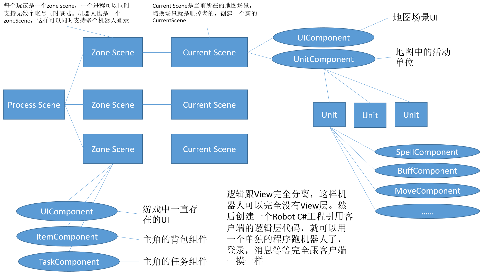
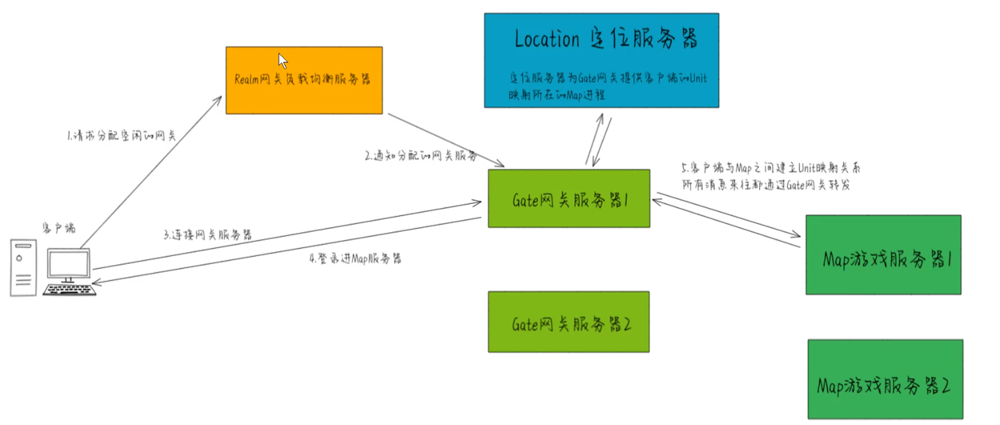

# ET6.0基础部分-重点

**ET-ECS组件编程原则:**

1. 实体即组件,组件即实体
2. 如要编写一个新的实体或者组件,绝不继承除Entity之外的任何父类
3. 绝不使用任何的虚函数,使用逻辑分发替代
4. Model和ModelView只存放实体和组件的数据字段声明,如非必要绝不放任何逻辑函数
5. Hotfix和HotfixView中只保留纯逻辑函数,也就是静态类和扩展方法编写的System,且绝不允许存在任何数据字段
6. Model和Hotfix中绝不允许出现跟Unity3d引擎相关的游戏对象类和调用相关API函数
7. 如实体或组件有数据字段声明必须编写相关生命周期函数,以防实体对象池回收再利用导致逻辑错误

## 客户端Scene

大部分都有

## 服务端Scene

## 机器人Scene

## 登录流程

## Demo搭建

**[Demo搭建](<https://blog.csdn.net/qq_41088607/article/details/122296018>)**

**[ET6.0运行Demo和工具使用](<https://www.cnblogs.com/cj8988/p/14600183.html>)**

Mongdo数据库推荐直接用宝塔搭建
