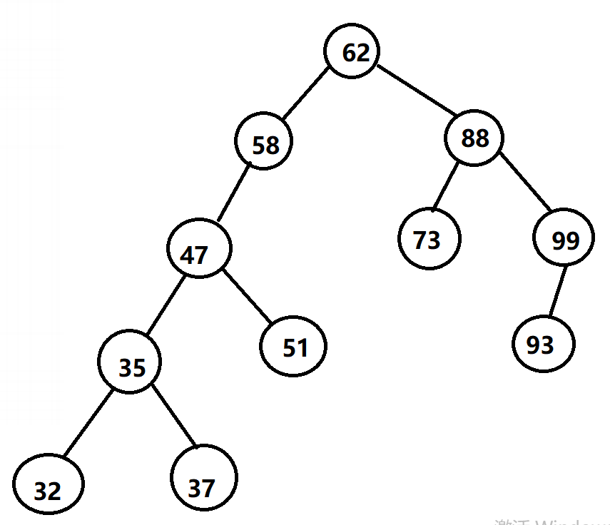

# 二叉排序树

https://zhuanlan.zhihu.com/p/142344455
https://blog.csdn.net/FHelloWorld/article/details/109540910

1:首先，我们以下图二叉排序树为例



2：构建节点类（孩子双亲表示法）

```c#
/****************************************************
	文件：BSNode.cs
	作者：黄山学院--Li Qingshan
	邮箱: 2781838262@qq.com
	日期：2020/05/20 16:58   	
	功能：
*****************************************************/
using System;
using System.Collections.Generic;
using System.Linq;
using System.Text;

namespace 二叉排序树_链式存储
{
    class BSNode
    {
        private BSNode parent = null;
        private BSNode leftChild = null;
        private BSNode rightChild = null;
        private int data;

        public int Data { get => data; private set => data = value; }
        internal BSNode Parent { get => parent; set => parent = value; }
        internal BSNode LeftChild { get => leftChild; set => leftChild = value; }
        internal BSNode RightChild { get => rightChild; set => rightChild = value; }

        public BSNode()
        {

        }

        public BSNode(int data)
        {
            this.data = data;
        }
    }
}
```

3：构建二叉排序树类

```C#
/****************************************************
	文件：BSTree.cs
	作者：黄山学院--Li Qingshan
	邮箱: 2781838262@qq.com
	日期：2020/05/20 16:59   	
	功能：
*****************************************************/
using System;
using System.Collections.Generic;
using System.Linq;
using System.Text;

namespace 二叉排序树_链式存储
{
    class BSTree
    {
        public BSNode root = null;

        //插入
        public void Add(int data)
        {
            BSNode node = new BSNode(data);

            if (root == null)
            {
                root = node;
            }
            else
            {
                BSNode maxNodeNode = root;

                while(true)
                {
                    if (data >= maxNodeNode.Data)//放在右边
                    {
                        if (maxNodeNode.RightChild == null)
                        {
                            maxNodeNode.RightChild = node;
                            node.Parent = maxNodeNode;
                            break;
                        }
                        else
                        {
                            maxNodeNode = maxNodeNode.RightChild;
                        }
                    }
                    else//放在左边
                    {
                        if (maxNodeNode.LeftChild == null)
                        {
                            maxNodeNode.LeftChild = node;
                            node.Parent = maxNodeNode;
                            break;
                        }
                        else
                        {
                            maxNodeNode = maxNodeNode.LeftChild;
                        }
                    }
                }
            }
        }

        //排序(中序遍历)
        public void MiddleTraversal(BSNode node)
        {
            if (node == null)
            {
                return;
            }

            MiddleTraversal(node.LeftChild);

            Console.Write(node.Data + " ");

            MiddleTraversal(node.RightChild);
        }

        //查找
        public bool Find(int item)
        {
            BSNode maxNodeRoot = root;

            while (true)
            {
                if (maxNodeRoot == null)
                {
                    return false;
                }

                if (maxNodeRoot.Data == item)
                {
                    return true;
                }

                if (item < maxNodeRoot.Data)
                {
                    maxNodeRoot = maxNodeRoot.LeftChild;
                }
                else
                {
                    maxNodeRoot = maxNodeRoot.RightChild;
                }
            }
        }

        //查找(递归)
        public bool Find(int item, BSNode node)
        {
            if (node == null)
            {
                return false;
            }

            if (node.Data == item)
            {
                return true;
            }

            if (item >= node.Data)
            {
                return Find(item, node.RightChild);
            }
            else
            {
                return Find(item, node.LeftChild);
            }
        }

        //删除指定值
        public bool Delete(int item)
        {
            BSNode maxNodeRoot = root;

            while (true)
            {
                if (maxNodeRoot == null)
                {
                    return false;
                }

                if (maxNodeRoot.Data == item)
                {
                    Delete(maxNodeRoot);
                    return true;
                }

                if (item < maxNodeRoot.Data)
                {
                    maxNodeRoot = maxNodeRoot.LeftChild;
                }
                else
                {
                    maxNodeRoot = maxNodeRoot.RightChild;
                }
            }
        }

        //删除指定节点
        private void Delete(BSNode node)
        {
            //需要删除的节点没有左右子树
            if (node.LeftChild == null && node.RightChild == null)
            {
                if (node.Parent == null)
                {
                    root = null;
                    return;
                }

                if (node.Data >= node.Parent.Data)
                {
                    node.Parent.RightChild = null;
                }
                else
                {
                    node.Parent.LeftChild = null;
                }
                return;
            }

            //需要删除的节点只有右子树
            if (node.LeftChild == null)
            {
                if (node.Parent == null)
                {
                    root = node.RightChild;
                    return;
                }

                if (node.Data >= node.Parent.Data)
                {
                    node.Parent.RightChild = node.RightChild;
                }
                else
                {
                    node.Parent.LeftChild = node.RightChild;
                }
                node.RightChild.Parent = node.Parent;
                return;
            }

            //需要删除的节点只有左子树
            if (node.RightChild == null)
            {
                if (node.Parent == null)
                {
                    root = node.LeftChild;
                    return;
                }

                if (node.Data >= node.Parent.Data)
                {
                    node.Parent.RightChild = node.LeftChild;
                }
                else
                {
                    node.Parent.LeftChild = node.LeftChild;
                }
                node.LeftChild.Parent = node.Parent;
                return;
            }

            //需要删除的节点左右子树都有
            BSNode minNode = FindMin(node.RightChild);

            if (minNode.Parent != node)
            {
                minNode.Parent.LeftChild = null;

                minNode.RightChild = node.RightChild;
                node.RightChild.Parent = minNode;
            }
            
            if (node.Parent == null || node.Data >= node.Parent.Data)
            {
                minNode.Parent = node.Parent;
                if (node.Parent != null)
                {
                    node.Parent.RightChild = minNode;
                }
            }
            else
            {
                minNode.Parent = node.Parent;
                node.Parent.LeftChild = minNode;
            }
            minNode.LeftChild = node.LeftChild;
            node.LeftChild.Parent = minNode;

            if (node.Parent == null)
            {
                root = minNode;
            }
        }

        //查找右子树中最小值
        private BSNode FindMin(BSNode rootNode)
        {
            if (rootNode.LeftChild == null)
            {
                return rootNode;
            }
            return FindMin(rootNode.LeftChild);
        }
    }
}
```

4：在main方法中构建二叉树排序树并调用相应方法(注意：可以通过打断点的方式查看删除操作是否正确）

```C#
/****************************************************
	文件：Program.cs
	作者：黄山学院--Li Qingshan
	邮箱: 2781838262@qq.com
	日期：2020/05/20 16:59   	
	功能：
*****************************************************/
using System;
using System.Collections.Generic;
using System.Linq;
using System.Text;

namespace 二叉排序树_链式存储
{
    class Program
    {
        static void Main(string[] args)
        {
            BSTree tree = new BSTree();
            //将二叉排序树按照层序遍历放在数组中
            int[] data = { 62, 58, 88, 47, 73, 99, 35, 51, 93, 32, 37,};
            foreach (var item in data)
            {
                //将数组中元素依次插入二叉排序树tree
                tree.Add(item);
            }

            //检验构建的二叉排序树是否正确
            //tree.MiddleTraversal(tree.root);

            //bool result = tree.Find(47);
            //bool result = tree.Delete(88);
            //Console.Write(result);

            Console.ReadKey();
        }
    }
}
```
